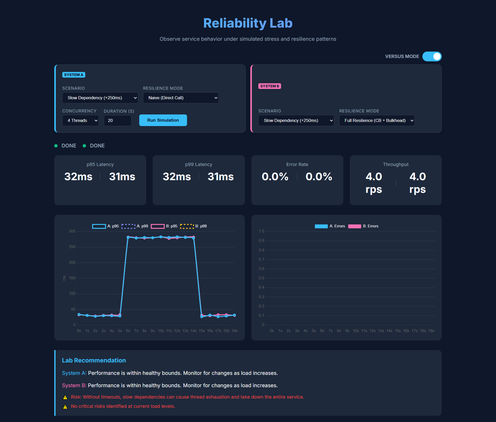
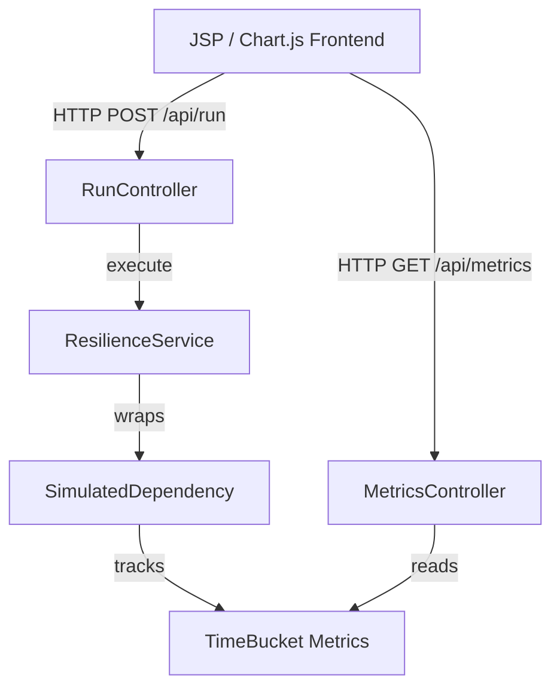

# Reliability Lab Dashboard




A high-performance Spring Boot 3.x sandbox designed to visualize the impact of distributed system failure patterns. This lab demonstrates how latency, error rates, and system stability respond to different resilience strategies in real-time.

---

## 📖 Guided Learning
If you are new to the project or preparing for an interview, start here:

*   **[Usage & Integration Guide](docs/guide.md)**: A step-by-step walkthrough of the experiments and how to apply these patterns in production.
*   **[Interview Walkthrough](docs/interview-walkthrough.md)**: How to talk about this project, the tradeoffs involved, and the "why" behind the design.
*   **[Architecture Decision Records (ADR)](docs/decisions/)**: Documentation of the engineering tradeoffs made during development.

---

## 🏗️ System Architecture
The system is designed for high-concurrency metric collection without external infrastructure dependencies.



---

## 🧪 Experiment Matrix

### Disruption Scenarios
| Scenario | Impact | Observable Behavior |
| :--- | :--- | :--- |
| **Slow Dependency** | +250ms Latency | P95/P99 latency spikes; thread exhaustion risk. |
| **Failing Dependency** | 30% Error Rate | Throughput drops; cascading failure potential. |
| **Traffic Spike** | 2x Concurrency | Queue buildup; resource contention. |

### Resilience Modes
| Mode | Strategy | Outcome |
| :--- | :--- | :--- |
| **Naive** | Direct Call | Maximum vulnerability; service "hangs" on slow deps. |
| **Timeouts** | Fail Fast (200ms) | Protects threads by converting latency into errors. |
| **Full Resilience** | Circuit Breaker | Short-circuits failing nodes to allow recovery. |

---

## 🚀 Getting Started

### Prerequisites
*   Java 17+
*   Maven 3.8+

### Quick Start
1.  **Clone the repository**
2.  **Build the project**
    ```bash
    mvn clean install
    ```
3.  **Run the application**
    ```bash
    mvn spring-boot:run
    ```
4.  **Access the Dashboard**
    Navigate to [http://localhost:8080/](http://localhost:8080/)

---

## 🔬 Scientific Method: What "Good" Looks Like
In this lab, a successful resilient configuration is defined by:
*   **Bounded Latency**: P95 remains within safe limits even during disruption windows.
*   **Deterministic Failure**: The system fails fast and predictably rather than hanging.
*   **Rapid Recovery**: Metrics return to baseline immediately after the disruption ends.

---

## 🔗 Related Lab Projects
*   **[Serialization Lab](https://github.com/[YOUR_USERNAME]/serialization-lab)**: A performance harness comparing Java Native Serialization vs. Apache Fory.

---
## 📄 License

This project is licensed under the MIT License - see the [LICENSE](LICENSE) file for details.

---
*This project is a demonstration tool and is not intended for production utility.*
